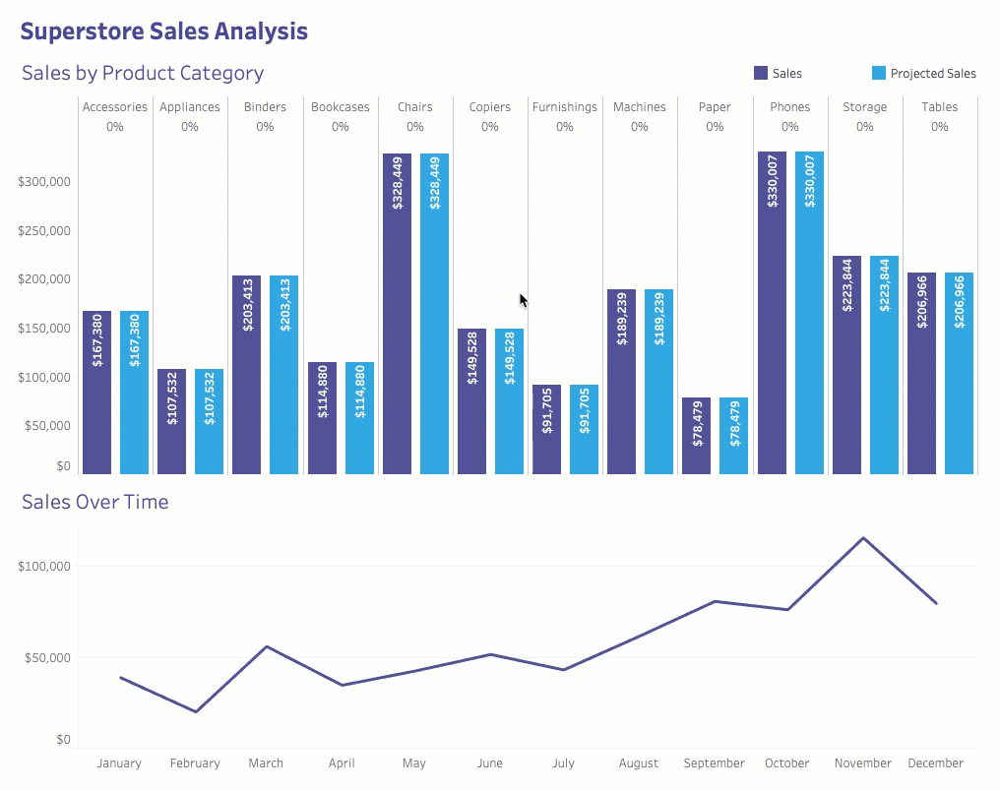

# Quick What-If

A dashboard extension that allows you to create a list of controllable inputs based on values of a dimension for quick what-if analysis.

## What it does

Imagine, you're a manager at Superstore and you're using Tableau to do a simple what-if analysis on sales. You want to be able to see how sales would change based on a percentage increase or decrease. But, you want to do this analysis at the product category level with different percentages for each. Well, that would require you to create a parameter for each and every category and write a long calculation to match them up. Then if a new category gets added you need to go back and add another parameter and update your calculations. Who has time for that!? Instead, with the Quick What-If extension, you simply create one parameter and one calculation, and then you get a list of controllable inputs for each category to do your what-if analysis automatically!

## How to use it

1. Before bringing in the extension make sure you have at least one worksheet on the dashboard that contains the dimension you want to pull values from. For example, if you wanted to do what-if analysis on the product categories like in the above image, you would need a worksheet on your dashboard with the "Category" dimension.
1. Next make a new **string** parameter that accepts **all** values. This will be your storage parameter where all input values are kept.
1. Now that your dashboard is set up, drag in a new extension object to your dashboard and select the Quick What-If extension.
1. In the configuration pop up select your storage parameter (which you made in step 2) and choose which worksheet and field you want to generate a list of inputs for.
1. Select how and when you want the inputs displayed within the options (more details below).
1. Save the configuration.
1. Create a new calculation with the following formula: `{FIXED [Dimension]: MIN(FLOAT(REGEXP_EXTRACT([Parameter], [Dimension]+"\|(-?\d*\.?,?\d*)")))}`
   where **Dimension** is the field you want to generate an input for and **Parameter** is your parameter.
1. Add this calculation to a view with your dimension.
1. Adjust the inputs in the extension to do your what-if analysis!

### Options

1. **Location of inputs**: Where do you want the inputs to show up? You can choose between a modal pop-up window or inline on the dashboard.
1. **Inputs to display**: Do you want to see all inputs or only the ones for the items you selected?
1. **Trigger**: How do you want to trigger the inputs to show up? When you click on a mark or based on a button on the dashboard.
1. **Unit label**: Choose a label to display above the inputs to let users know what unit the numbers are.
1. **Button text**: If you are using the button option you can change the words found on it.

Note: If you are using options that eliminate the need for the inline dashboard zone to be displayed you can simply hide the extension by floating it and making it 1x1 pixel. You can always find it later in the layout pane.

## How to install for local use

1. Copy the files in the `dist` folder to your web server.
1. Update the existing or create a new manifest file (.trex) to point to the URL where you are hosting the extension.

## Support

If you have questions about the extension or found a bug please open a new [issue](https://github.com/tableau/extension-quick-what-if/issues).
